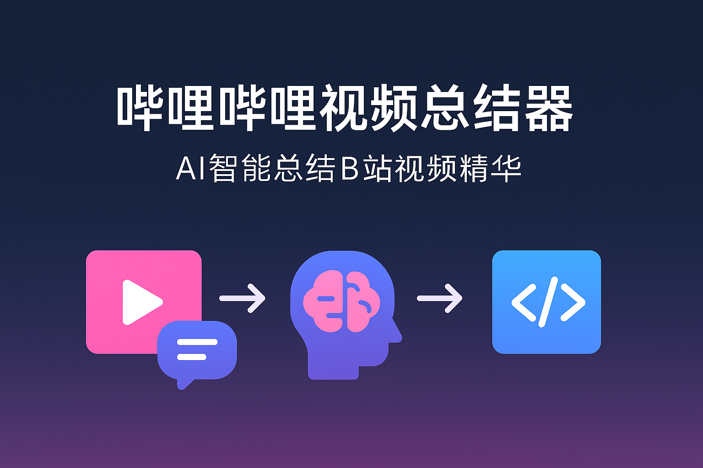

<h1 align="center">哔哩哔哩视频总结器</h1>

<p align="center">
  <a href="https://github.com/The-Pocket/PocketFlow" target="_blank">
    
  </a>
</p>

## 项目简介

哔哩哔哩视频总结器是一个使用PocketFlow构建的工具，可以自动从哔哩哔哩视频中提取字幕，并生成视频内容的摘要。该工具使用yutto获取字幕，并利用大语言模型生成易于理解的中文摘要，最终输出一个美观的HTML页面。

## 功能特点

- 自动从B站视频URL获取字幕
- 利用大语言模型生成高质量摘要
- 生成美观的HTML摘要页面
- 支持自定义LLM配置，包括模型名称、API基础URL和API密钥

## 安装与使用

### 环境配置

1. 克隆项目并进入项目目录
```bash
git clone https://github.com/<你的用户名>/BilibiliSummarier.git
cd BilibiliSummarier
```

2. 使用conda创建虚拟环境并激活
```bash
conda create -n bilibili-summary python=3.10
conda activate bilibili-summary
```

3. 安装依赖
```bash
pip install -r requirements.txt
```

### 使用方法

1. 运行主程序
```bash
python main.py
```

2. 按照提示输入：
   - B站视频URL
   - B站SESSDATA（必选，用于下载字幕）
   - OpenAI API密钥（可选，默认使用环境变量）
   - 模型名称（可选，默认使用gpt-3.5-turbo）
   - API基础URL（可选，默认使用OpenAI官方API）

3. 等待处理完成，程序会自动生成摘要HTML文件并显示文件路径

## 获取SESSDATA

由于B站的限制，下载字幕需要提供SESSDATA：

1. 在浏览器中登录哔哩哔哩
2. 按F12打开开发者工具
3. 切换到Application/应用标签
4. 在左侧找到Cookies，展开后选择bilibili.com
5. 找到名为SESSDATA的Cookie，复制其值

## 项目结构

```
BilibiliSummarier/
├── main.py                  # 主程序入口
├── flow.py                  # PocketFlow流程定义
├── nodes.py                 # 流程节点定义
├── utils/                   # 工具函数
│   ├── call_llm.py          # LLM调用函数
│   ├── download_subtitle.py # 字幕下载函数
│   ├── process_subtitle.py  # 字幕处理函数
│   └── generate_html.py     # HTML生成函数
└── requirements.txt         # 项目依赖
```

## 环境变量配置

您可以通过设置以下环境变量来配置程序（也可以在运行时直接输入）：

- `OPENAI_API_KEY`: OpenAI API密钥（用于生成摘要）

## 自定义LLM配置

本工具支持使用不同的大语言模型服务：

- **自定义模型**：可以指定任何受支持的模型名称（如gpt-3.5-turbo、gpt-4o、pro-gemini-2.0-flash等）
- **自定义API端点**：可以连接到任何兼容OpenAI API的服务（如Azure OpenAI、本地部署的模型等）
- **自定义API密钥**：可以在运行时提供API密钥，无需设置环境变量

## 注意事项

- 本工具需要安装yutto，详见yutto的[官方文档](https://yutto.nyakku.moe/)
- 请遵守B站的使用条款，不要过度频繁地使用此工具
- SESSDATA是必选的，否则无法下载字幕
- 生成的摘要质量取决于所使用的语言模型和字幕质量
